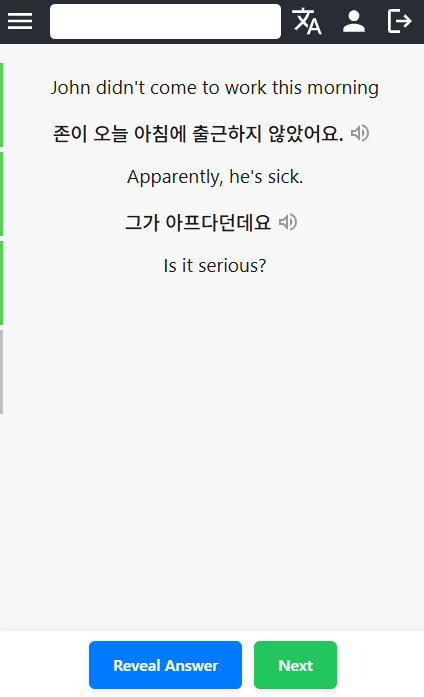

# Fluent

Spaced-repetition language learning from bilingual conversations. React/TypeScript
SPA, Node/Express API, MongoDB.

Production: **[fluent.study](https://fluent.study)**



## Data model

Scheduling operates on lexical items; exposure happens through conversations.

| Collection | Shape |
|---|---|
| `LexicalItem` | One word, expression or grammar pattern, in one language. `translations[]` holds `{ language, lexicalItems[] }` — a many-to-many graph across languages, not a pair. `tags[] → WordTag`. |
| `MultiLingualConversation` | One exchange in several languages. Each sentence carries `prerequisites[] → LexicalItem`. |
| `UserCourse` | One (source, target) pair per user. `words[]` carries `nextReviewDate` per item, `conversations[]` carries `lastReviewDate`. Plus score, streaks, rank, milestones. |
| `Story` / `StoryNode` | Node graph. Each node has `prerequisites[] → LexicalItem` and `nextIds[]`; a node opens once its prerequisites are acquired. |

A `LexicalItem` id is referenced from four sites:
`LexicalItem.translations[].lexicalItems`, `UserCourse.words[]._id`,
`MultiLingualConversation…sentences[].prerequisites`, `StoryNode.prerequisites`.
Merging or deleting an item repoints all four.

## Constraints

- **Item text is an identity key.** `-고 싶다` and `-고 싶어요` stored as two rows
  split one learner's progress across both. Content is generated by a separate
  LLM pipeline, which enforces per-language citation-form conventions at
  generation time.
- **Vocabulary syncs incrementally.** The client caches words in local storage and
  calls `GET /api/words?lastUpdateDate=…` for the delta.
- **Redis is optional in development.** `--no-redis` skips the cache middleware;
  MongoDB is the only hard dependency.
- **Audio is pre-generated** per sentence, after translation review, and cached.
  Not synthesised at request time.

## Stack

| | |
|---|---|
| Frontend | React 18, TypeScript 5, Vite 7, vite-plugin-pwa (service worker, offline-capable), i18next (en/fr/ko) |
| Backend | Express 4, Mongoose 8, Redis, JWT + Google OAuth, Google Cloud TTS, pino |
| Tooling | Jest, Vitest, GitHub Actions, PM2, Node 20 |

## Tests

85 backend (Jest, supertest, models mocked — no database needed), 27 frontend
(Vitest, Testing Library).

```bash
cd fluent-backend  && npm test
cd fluent-frontend && npm test
```

## CI/CD

`.github/workflows/node.js.yml`. A `test` job runs both suites and the frontend
build; `deploy` declares `needs: test`. Pull requests run tests without deploying.
Deployment is ssh, build, `rsync` into the API's static directory, `pm2 reload` —
with `script_stop` set, so a failing step aborts the rest of the script instead of
publishing the previous build.

## Local setup

### Prerequisites

- **Node.js** (v18+)
- **npm**
- A **MongoDB Atlas** cluster (connection details go in the backend `.env`) — don't forget to whitelist your IP in Atlas under **Network Access** before connecting
- A **Redis** instance (optional — the backend skips it when started with `--no-redis`)

### 1. Install dependencies

Run this once from the repo root. It installs root-level tooling (concurrently) and the dependencies for both workspaces.

```bash
npm install
cd fluent-backend && npm install
cd ../fluent-frontend && npm install
```

### 2. Configure environment variables

#### Backend — `fluent-backend/.env`

Create the file with the following keys:

```env
MONGO_USERNAME=<your Atlas username>
MONGO_PASSWORD=<your Atlas password>
MONGO_CLUSTER=<your Atlas cluster host>
MONGO_DBNAME=<your Atlas DB name>
EMAIL_USER=<your email user>
EMAIL_PASS=<your email pass>
JWT_SECRET=<any long random string>
NODE_ENV=development

# Optional — Social OAuth
GOOGLE_CLIENT_ID=...
GOOGLE_CLIENT_SECRET=...
GOOGLE_REDIRECT_URI=http://localhost:3000/login?provider=google

FRONTEND_URL=http://localhost:3000
```

#### Frontend — `fluent-frontend/.env.development`

Create the file with the following keys:

```env
VITE_API_URL=http://localhost:4001/api/
```

### 3. Start the dev servers

From the **repo root**, run both servers concurrently:

```bash
npm run dev
```

This runs:

- **Backend** on `http://localhost:4001` (nodemon, hot-reload, Redis skipped via `--no-redis`)
- **Frontend** on `http://localhost:3000` (Vite)

To run them separately:

```bash
npm run dev:backend   # backend only
npm run dev:frontend  # frontend only
```

### 4. Running tests

```bash
# Backend (Jest + supertest)
cd fluent-backend
npm test
npm run test:watch      # watch mode
npm run test:coverage   # with coverage report

# Frontend (Vitest)
cd fluent-frontend
npm test
npm run test:watch
```
